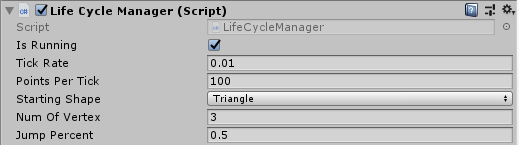

# chaos-game

[Sierpinski Triangle](https://en.wikipedia.org/wiki/Sierpinski_triangle "Sierpinski Triangle")

Description
----
The "game" starts with a set number of generated points as the *starting vertices*. One random point is then chosen at any visible location as the *current point*. Each iteration or *tick* a random starting vertices will be chosen. The next point is then set to the middle point between the current point and the chosen vertices. This new point becomes the current point. The process continues on repeating the same process of chosing a starting vertices and moving half way towards it from the current point.

`Sometimes this will create interesting patterns from what seems to be chaotic random points being chosen.`

More details can be found on [Wikipedia](https://en.wikipedia.org/wiki/Chaos_game "Chaos Game").

Usage
----
Inside of the scene the only thing required is the main camera. The *LifeCycleManager* script is then attached to that main camera.

The game can be stated and paused at any point by unchecking **IsRunning** variable for the *LifeCycleManager* OR by pressing the space bar.

Parameters
----

| Variable   | Type       | Description |
| ---------- |------------| -------------------------------|
| IsRunning  | `<string>` | Set the game state as running or stopped. |
| TickRate   | `<float>`  | Set the time between each generation or tick. |
| StartingShape | `<enum>`  | Set the shape the game will start running as. |
| NumOfVertex | `<float>`  | Set the number of vertex the shape will have if StartingShape is set to random. |
| JumpPercent  | `<float>` | Allows the percentage the new point will jump to be set(0.0-1.0). |

